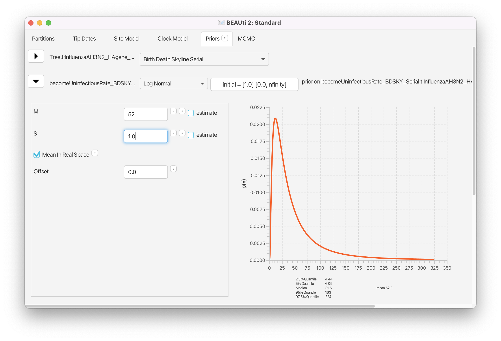
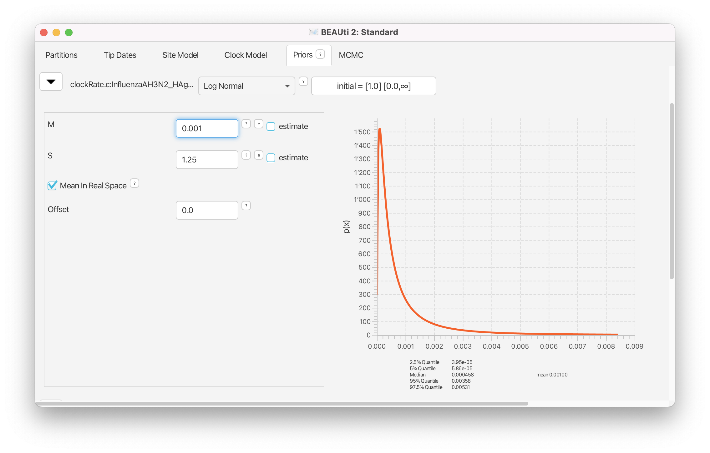
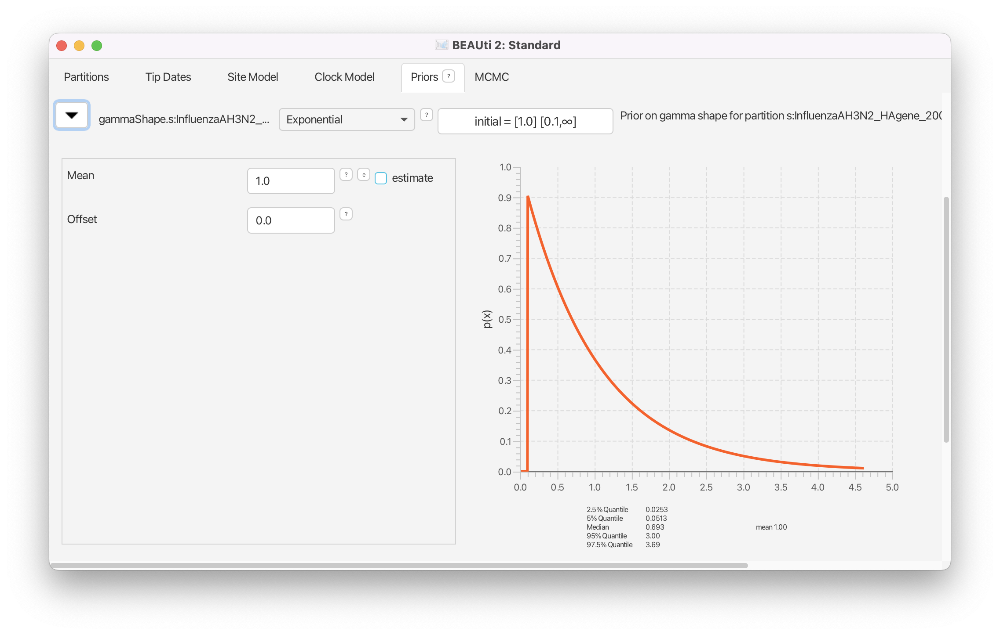
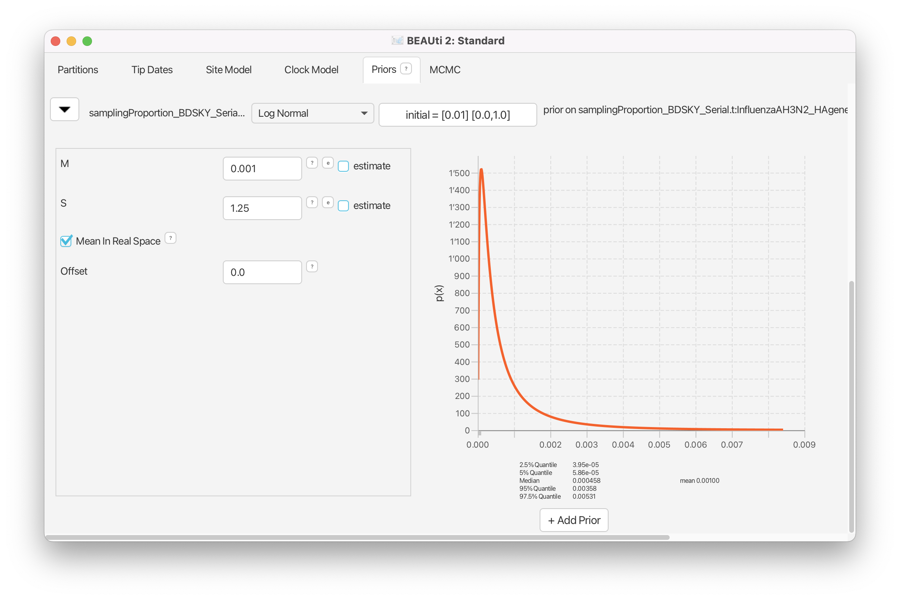

# Background

In the Bayesian analysis of sequence data, priors play an important role. When priors are not specified correctly it may cause runs to take very long to converge, not converge at all or cause a bias in the inferred trees and model parameters. Selection of proper priors and starting values is crucial and can be a difficult exercise in the beginning. It is not always easy to pick a proper model of tree generation (tree prior), substitution model, molecular clock model or the prior distribution for an unknown parameter. 

The molecular clock model aims to estimate the substitution rate of the data. It is important to understand under which circumstances to use which model and when molecular calibration works. This will help the investigator determine which estimates of parameters can be trusted and which cannot.

In this tutorial, we will explore how priors are selected and how molecular clock calibration works using the H3N2 influenza A data from the flu virus spreading in the USA in 2009. 

----

# Programs used in this Exercise

### BEAST2 - Bayesian Evolutionary Analysis Sampling Trees

BEAST2 is a free software package for Bayesian evolutionary analysis of molecular sequences using MCMC and strictly oriented toward inference using rooted, time-measured phylogenetic trees. This tutorial is written for BEAST v{{ page.beastversion }} .

### BEAUti2 - Bayesian Evolutionary Analysis Utility

BEAUti2 is a graphical user interface tool for generating BEAST2 XML configuration files.

Both BEAST2 and BEAUti2 are Java programs, which means that the exact same code runs on all platforms. For us it simply means that the interface will be the same on all platforms. The screenshots used in this tutorial are taken on a Mac OS X computer; however, both programs will have the same layout and functionality on both Windows and Linux. BEAUti2 is provided as a part of the BEAST2 package so you do not need to install it separately.

### TreeAnnotator

TreeAnnotator is used to summarise the posterior sample of trees to produce a maximum clade credibility tree. It can also be used to summarise and visualise the posterior estimates of other tree parameters (e.g. node height).

TreeAnnotator is provided as a part of the BEAST2 package so you do not need to install it separately.

### Tracer 

Tracer ([http://tree.bio.ed.ac.uk/software/tracer](http://tree.bio.ed.ac.uk/software/tracer)) is used to summarize the posterior estimates of the various parameters sampled by the Markov Chain. This program can be used for visual inspection and to assess convergence. It helps to quickly view median estimates and 95% highest posterior density intervals of the parameters, and calculates the effective sample sizes (ESS) of parameters. It can also be used to investigate potential parameter correlations. We will be using Tracer v{{ page.tracerversion }}.

### FigTree

FigTree ([http://tree.bio.ed.ac.uk/software/figtree](http://tree.bio.ed.ac.uk/software/figtree)) is a program for viewing trees and producing publication-quality figures. It can interpret the node-annotations created on the summary trees by TreeAnnotator, allowing the user to display node-based statistics (e.g. posterior probabilities). We will be using FigTree v{{ page.figtreeversion }}.

----

# Practical: H3N2 flu dynamics - heterochronous data
In this tutorial, we will estimate the rate of evolution from a set of virus sequences that have been isolated either at one point in time (homochronous) or at different points in time (heterochronous or time-stamped data). We use the hemagglutinin (HA) gene of the H3N2 strain spreading across America alongside the pandemic H1N1 virus in 2009 . 

The aim of this tutorial is to obtain estimates for the: 

-  rate of molecular evolution
-  phylogenetic relationships with measures of internal node heights
-  date of the most recent common ancestor of the sampled virus sequences.

The more general aim of this tutorial is to:

-  understand how to set priors and why this is important
-  understand why and when the rate of evolution can be estimated from the data.

## The Data

The full heterochronous dataset contains an alignment of 139 HA sequences 1738 nucleotides long. The samples were obtained from California between April and June 2009 (file named 
`InfluenzaAH3N2_HAgene_2009_California_heterochronous.nexus`). The homochronous data is a subset of the heterochronous data, consisting of an alignment of 29 sequences of 1735 nucleotides all sampled on April 28, 2009 (file named `InfluenzaAH3N2_HAgene_2009_California_homochronous.nexus`). 

## Creating the Analysis File with BEAUti

We will use BEAUti to select the priors and starting values for our analysis and save these settings into a BEAST-readable XML file. 

> Begin by starting the BEAUti program.
> 

### Installing BEAST 2 Plug-Ins

Since we will be using the birth-death skyline model (**BDSKY**) , we need to make sure it is available in BEAUti. It is not one of the default models but rather an add-on (also called a plug-in or package). You only need to install a BEAST2 package once. Thus, if you close BEAUti, you do not have to load **BDSKY** the next time you open the program. However, it is worth checking the package manager for updates to plug-ins, particularly if you update your version of BEAST2. For this tutorial we need to ensure that we have at least BDSKY v{{ page.bdskyversion }} installed.

> Open the **BEAST 2 Package Manager** by navigating to **File > Manage Packages**. ([Figure 1](#packageManage1))
> 

<figure>
	
	
	<figcaption>Figure 1: Finding the BEAST2 Package Manager.</figcaption>
</figure>
 

> Install the **BDSKY** package by selecting it and clicking the **Install/Upgrade** button. ([Figure 2](#packageManage2))
> 

<figure>
	
	
	<figcaption>Figure 2: The BEAST2 Package Manager.</figcaption>
</figure>
 

After the installation of an add-on, the program is on your computer, but BEAUti is unable to load the template files for the newly installed model unless it is restarted. So, let's restart BEAUti to make sure we have **BDSKY** model at hand.

> Close the **BEAST 2 Package Manager** and **_restart_** BEAUti to fully load the **BDSKY** package.
> 

### Importing alignment

We will first analyse the alignment of sequences sampled through time (heterochronous sequences). 
 

> In the **Partitions** panel, import the nexus file with the alignment by navigating to **File > Import Alignment** in the menu ([Figure 3](#importAlignment)) and then finding the file called `InfluenzaAH3N2_HAgene_2009_California_heterochronous.nexus`  file on your computer.
> 

<figure>
	
	
	<figcaption>Figure 3: Importing alignment into BEAUti.</figcaption>
</figure>
 

You can view the alignment by double-clicking on the name of the alignment in BEAUti. Since we only have one partition there is nothing more we can do in the **Partitions** panel and proceed to specifying the tip dates. 

### Setting up tip dates

The heterochronous dataset contains the information on when the sequences were sampled. We want to use this information to specify the tip dates in BEAUti. 

> In the **Tip Dates** panel, click the **Use tip dates** option. 
> 

We want all the tree information to be specified for units of time in "years", thus we leave the **Dates specified as** option set to default "year". Also we want the time to flow forward in time in the tree, therefore, we keep to default option of tip dates being specified as "Since some time in the past" ([Figure 4](#timeUnitsAndFlow)).

<figure>
	
	
	<figcaption>Figure 4: Specifying time units and direction of time flow.</figcaption>
</figure>
 

You could specify the tip dates by hand, by clicking for each row (i.e. for each sequence) into the **Date** column and typing the date information in for each sequence in turn. However, this is a laborious and error-prone procedure and can take a long time to finish. Fortunately, we can use BEAUti, to read off the dates from the sequence names for us. Each sequence is named such that the expression after the last underscore character ("_") contains the sampling date information. BEAUti can search for this expression to extract the sequence date.

> Press the **Guess** button. A window will appear where you can specify how BEAUti can find the date of sampling of each sequence. ([Figure 5](#guessDates))
> 
> Select **use everything** and specify **after last** _.
> 

<figure>
	
	
	<figcaption>Figure 5: Specifying tip dates.</figcaption>
</figure>
 

You should now see that the tip ages have been filled in for all of the taxa and that the **Date** columns shows a number in form 2009.xyz and the **Height** column shows the number in form 0.abc (the height of the tip from present time, where present is 0.0).

Now we are done with the data specification and we are about to start specifying models and priors for the model parameters. 

### Specifying the Site Model

> Navigate to the **Site Model** panel, where we can choose the model of nucleotide evolution that we want to assume to underly our dataset. 
> 

Our dataset is made of nucleotide sequences. There are four models of nucleotide evolution available in BEAST2: JC69, HKY, TN93 and GTR. JC69 model is the simplest evolutionary model. All the substitutions are assumed to happen with the same rate and all the bases are assumed to have identical frequencies, i.e. each base A, C, G and T is assumed to have an equilibrium frequency of 0.25. In HKY model, the rate of transitions A  G and C  T is allowed to be different from the rate of transversions A  C, G  T. Furthermore, the frequency of each base can be either "Estimated", "Empirical" or "All Equal". When we set the frequencies to "Estimated", the frequency of each base will be co-estimated as a parameter during the BEAST run. If we use "Empirical", base frequencies will be set to the frequencies of each base found in the alignment. Finally, if set to "All Equal", the base frequencies will be set to 0.25. The TN93 model is slightly more complicated than HKY, by allowing for different rates of A  G and C  T transitions. Finally, the GTR model is the most general model and allows for different substitution rates between each pair of nucleotides as well as different base frequencies, resulting in a total of 9 free parameters. 

> **QUESTION: Which substitution model may be the most appropriate for our dataset and why?** 
> 
> You can discuss with your neighbour or with the teaching assistants if you like. After you have made your decision, continue with the tutorial.
> 

Since we do not have any extra information on how the data evolved, the decision is not clear cut. The best would be to have some independent information on what model fits the influenza data the best. Alternatively, one could perform model comparison, or apply reversible jump MCMC (see for example the  bModelTest and substBMA packages) to choose the best model. Let's assume, we have done some independent data analyses and found the HKY model to fit the influenza data the best. In general, this model captures the major biases that can arise in the analysis of the nucleotide data. 

Now we have to decide whether we want to assume all of the sites to have been subject to the same substitution rate or if we want to allow for the possibility that some sites are evolving faster than others. For this, we choose the number of gamma rate categories. This model scales the substitution rate by a factor, which is defined by a Gamma distribution. If we choose to split the Gamma distribution into 4 categories, we will have 4 possible scalings that will be applied to the substitution rate. The probability of a substitution at each site will be calculated under each scaled substitution rate (and corresponding transition probability matrix) and averaged over the 4 outcomes.
  

> **QUESTION: Do you think a model that assumes one rate for all the sites is preferable over a model which allows different substitution rates across sites (i.e. allows for several gamma rate categories)? Why or why not?** 
> 
> You can again discuss with your neighbour or with the teaching assistants if you like. After you have made your decision, continue with the tutorial.
> 

Once again, a proper model comparison, i.e. comparing a model without gamma rate heterogeneity to a model with some number of gamma rate categories, should ideally be done. We do not have any independent information on whether gamma rate categories are needed or not. Thus, we take our best guess in order not to bias our analyses. Since the data are the sequences of the HA (hemagglutinin) gene of influenza, we may want to allow for variation of the substitution rates between sites. Hemagglutinin is a surface protein on the virus and is under significant evolutionary pressure from the immune system of the host organism. It is not unrealistic to assume that some sites may be under more pressure to escape from the immune system.

Let us therefore choose the HKY model with 4 gamma rate categories for the substitution rate. 

> Change the **Gamma Category Count** to 4, tick the estimate box next to the **Shape** parameter of the Gamma distribution and set the **Subst Model** to **HKY**. Make sure that both **Kappa** and **Frequencies** are estimated. ([Figure 6](#substitutionModel)) 
> 

<figure>
	
	
	<figcaption>Figure 6: Specifying substitution model.</figcaption>
</figure>
 

Notice that we estimate the shape parameter of the Gamma distribution as well. This is generally recommended, unless one is sure that the Gamma distribution with the shape parameter equal to 1 captures exactly the rate variation in the given dataset.
Notice also, that we leave the substitution rate fixed to 1.0 and do not estimate it. In fact, the overall substitution rate is the product of the clock rate and the substitution rate (one of the two acting as a scalar rather than a quantity measured in number of substitutions per site per time unit), and thus fixing one to 1.0 and estimating the other one allows for estimation of the overall rate of substitution. We will therefore use the clock rate to estimate the number of substitutions per site per year. 

### Specifying the Clock Model

> Navigate to the **Clock Model** panel.
> 

Four different clock models are available in BEAST 2, allowing us to specify lineage-specific substitution rate variation. The default model in BEAUti is the *Strict Clock*. The other three models relax the assumption of a constant substitution rate. The *Relaxed Clock Log Normal* allows for the substitution rates associated with each branch to be independently drawn from a single, discretized log normal distribution . Under the *Relaxed Clock Exponential* model, the rates associated with each branch are drawn from an exponential distribution . Both of these models are uncorrelated relaxed clock models. The log normal distribution has the advantage that one can estimate its variance, which reflects the extent to which the molecular clock needs to be relaxed. In both models, BEAUti sets by default the **Number Of Discrete Rates** to -1. This means that the number of bins that the distribution is divided into is equal to the number of branches. The last available model is the *Random Local Clock* which averages over all possible local clock models . 

> **QUESTION: Which clock model may be the most appropriate for our dataset and why?** 
> 

Since we are observing the sequence data from a single epidemic of H3N2 virus in humans in a single location (south-west of USA), we do not have any reason to assume different substitution rates for different lineages. Thus, the most straightforward option is to choose the default **Strict Clock** model ([Figure 7](#clockModel)). Note however, that a rigorous model comparison would be the best way to proceed with the choice of the clock model.

<figure>
	
	
	<figcaption>Figure 7: Specifying the clock model.</figcaption>
</figure>
 

### Selecting Priors

> Navigate to the **Priors** panel.
> 

Since the dynamics of influenza virus is likely to change due to the depletion of the susceptible population and/or the presence of the resistant individuals, we choose the birth-death skyline model of population dynamics with 5 time intervals for , to capture this likely change of dynamics over time. , the basic reproductive number, is an important variable for the study of infectious diseases, since it defines how many individuals a single infected individual infects on average in a completely susceptible population over the course of her/his infection. , the effective reproduction number, is the average number of secondary infections caused by an infected individual at a given time during the epidemic. Thus,  is a function of time. In other words, it tells us how quickly the disease is spreading in a population. As long as  is above 1 the epidemic is likely to continue spreading, therefore prevention efforts aim to push  below 1. Note that as more people become infected and the susceptible population decreases  will naturally decrease over the course of an epidemic, however treatment, vaccinations, quarantine and changes in behaviour can all contribute to decreasing  faster. In a birth-death process,  is defined as the ratio of the birth (or speciation) rate and the total death (or extinction) rate.   for any infection is rarely above 10, so we set this as the upper value for  in our analysis.

> For the **Tree** model, select the option **Birth Death Skyline Serial**. 
> 
> Then, click in the arrow to the left from **reproductiveNumber** to open all the options for  settings ([Figure 8](#treePrior)). Leave all the settings to the default, since it specifies a prior that is not too strong and centered around 1. This is exactly what we want. 
> 
> Then, click on the button where it says **initial = [2.0] [0.0, Infinity]**. A pop-up window will show up ([Figure 9](#RePrior)).
> 
> In the pop-up window change the **Upper**, the upper limit of the prior distribution, from Infinity to 10 and the **Dimension** of the  from 10 to 5 and click **OK**.
> 

<figure>
	
	
	<figcaption>Figure 8: Specifying the tree prior.</figcaption>
</figure>
 

<figure>
	
	
	<figcaption>Figure 9: Specifying the  prior.</figcaption>
</figure>
 

Notice that the pop-up window allows one to specify not only the **Dimension** but also the **Minordimension**. If the parameter is specified as a vector of  entries, we only use the **Dimension** with input . If the parameter is specified as an n x m matrix, we then use the **Minordimension** to specify the number of columns (m) the parameter is split into. In the birth-death skyline model, we use the parameter vector only, and thus the **Minordimension** always stays specified as 1. (In fact, **Minordimension** is only used very rarely in any BEAST2 model).

After we have specified the prior for , the next prior that needs our attention is the **becomeUninfectiousRate**. This specifies how quickly a person infected with influenza recovers. From our personal experience, we would say, it takes around one week to 10 days from infection to recovery. Since the rate of becoming uninfectious is the reciprocal of the period of infectiousness this translates to a becoming uninfectious rate of 365/10=36.5 to 365/7  52.14 per year (recall that we specified dates in our tree in years, and not days). Let us set the prior for **becomeUninfectiousRate** rate accordingly. 

>  Click on the arrow next to **becomeUninfectiousRate** and change the value for **M** (mean) of the default log normal distribution to 52 and tick the box **Mean In Real Space** to specify the mean of the distribution in real space instead of log space ([Figure 10](#becomeUninfectiousPrior)).
> 

<figure>
	
	
	<figcaption>Figure 10: Specifying the become uninfectious prior.</figcaption>
</figure>
 

Looking at the 2.5% and 97.5% quantiles for the distribution we see that 95% of the weight of our becoming uninfectious rate prior falls between 4.44 and 224, i.e. our prior on the period of infectiousness is between  1.63 and 82.2 days. Thus, our prior is quite diffuse. If we wanted to use a more specific prior we could decrease the standard deviation of the distribution (the **S** parameter).

Now we have to specify the clock rate prior. This is the prior for the substitution rate.

> **QUESTION: What substitution rate is appropriate for viruses? More specifically, what substitution rate is expected for influenza virus, in your opinion?** 
> 

By default, the clock rate in BEAST2 has a uniform prior between 0 and infinity. This is not only extremely unspecific, but also an improper prior (it does not integrate to 1). In general, a log-normal distribution works well for rates, since it does not allow negative values. Furthermore, it places most weight close to 0, while also allowing for larger values, making it an appropriate prior for the clock rate, which we expect to be quite low in general, but may be higher in exceptional cases. You could set your best guess as a prior by, for example, choosing a log-normal distribution centered around your best guess for the substitution rate.

Now consider the following information: Influenza virus is an RNA virus  and RNA viruses in general, have a mutation rate of  10^(-3) substitutions per site per year . 

> **QUESTION: Did you change your best guess, for the substitution rate appropriate for RNA viruses? What would it be? How would you specify the prior?** 
> 

Our best guess would be to set the prior distribution peaked around 10^(-3) substitutions per site per year.

> Change the prior for the clock rate from a **Uniform** to **Log Normal** distribution. Click on the arrow next to the **clockRate** and change the value for **M** (mean) of the default log normal distribution to 0.001 and tick the box **Mean In Real Space** ([Figure 11](#clockRatePrior)).
> 

<figure>
	
	
	<figcaption>Figure 11: Specifying the clock rate prior.</figcaption>
</figure>
 

We also need to estimate the Gamma shape parameter, which governs the shape of the Gamma distribution of the rates across different sites. The default setting of the Gamma shape parameter of **alpha=beta=1.0** reflects our belief that on average, the rate scaler is equal to 1, i.e. on average all the sites mutate with the same substitution rate. The distribution on the gamma shape parameter allows us to deviate from this assumption. The default exponential distribution with **M** (mean) of 1.0 and 95%HPD of [0.0253,3.69] covers a wide range of possible shape parameters. This looks fine for our analysis, and thus, we leave the Gamma shape settings at its defaults ([Figure 12](#gammaShapeprior)).
 
<figure>
	
	
	<figcaption>Figure 12: Specifying the gamma shape prior.</figcaption>
</figure>
 

We do not have any prior information on transition-transversion ratio besides the fact that it is a value usually larger than 1 (transitions are more frequent than transversions). We therefore set a weakly informative prior for this parameter. The default log normal prior perfectly fits to these requirements and usually does not need to be changed ([Figure 13](#kappaPrior)). 

<figure>
	
	
	<figcaption>Figure 13: Specifying the kappa (transition/transversion ratio) prior.</figcaption>
</figure>
 

For the next parameter, the origin of the epidemic, we ask ourselves whether there is any reasonable expectation we might have in terms of when the infection in California started, i.e. what is the date when the ancestor of all of the sequences first appeared.

> **QUESTION: Do you have any feeling for what the origin should/could be set to?** 
> 

The data span a period of 3 months and come from a limited area; thus, it would be unreasonable to assume that a single season flu epidemic would last longer than a few months. The best guess for the origin parameter prior we could make is therefore on the order of at least 3-4, but probably no more than 6 months. We set the prior according to this expectation.

> Click on the arrow next to the **origin** and change the prior distribution from **Uniform** to **Gamma** with **Alpha** parameter set to 0.5 and **Beta** parameter set to 2.0 ([Figure 14](#originPrior)).
> 

<figure>
	
	
	<figcaption>Figure 14: Specifying the origin prior.</figcaption>
</figure>
 

Lastly, for the sampling proportion, we know that we certainly did not sample every single infected individual. Therefore, setting a prior close to 1 would not be reasonable. Actually, it is more reasonable to usually expect only a proportion of less than 0.1 of all flu cases to be sampled. Here, we specify something on the order of 10^(-3). The default prior for the sampling proportion is a Beta distribution, which is only defined between 0 and 1, making it a natural choice for proportions. However, this is not the only prior that can be used, and here we specify a log-normal distribution, while ensuring that an appropriate upper limit is set, to prevent a sampling proportion higher than 1, which is not defined. 

> Click on the arrow next to the **samplingProportion** and change the distribution from **Beta** to **Log Normal**. 
> 
> Next, change the value for the **M** (mean) to 0.001 and tick the box **Mean In Real Space** ([Figure 15](#samplingProportionPrior)).
> 
> Also, make sure that the **Lower** is set to 0.0 and the **Upper** is set to 1.0.
> 

<figure>
	
	
	<figcaption>Figure 15: Specifying the sampling proportion prior.</figcaption>
</figure>
 

### MCMC

> Navigate to the **MCMC** panel.
> 

We want to shorten the chain length, in order for it to run in a reasonable time and we want to decrease the tree sampling frequency.

> Change the **Chain Length** from 10'000'000 to 5'000'000.
> 
> Click on the arrow next to the **treelog** and set the **Log Every** to 100'000 ([Figure 16](#mcmc)).
> 

<figure>
	
	
	<figcaption>Figure 16: Specifying the MCMC properties.</figcaption>
</figure>
 

Now, all the specifications are done. We want to save and run the XML.

> Save the XML file as `Heterochronous.xml`.
> 

### Running the analysis

> Within BEAST, specify the file Heterochronous.xml. 
> 
> If you have BEAGLE installed tick the box to **Use BEAGLE library if available**, which will make the run faster.
>
> Hit **Run** to start the analysis.
> 

The run should take about 15-20 minutes. While waiting for your results, you can start preparing the XML file for the homochronous data.

### Analysing the results

> Load the file into **Tracer** to check mixing and the parameter estimates. 
> 

<figure>
	
	
	<figcaption>Figure 17: Loading the log file into Tracer.</figcaption>
</figure>
 

First thing you may notice is that most of the parameters do have low ESS (effective sample size below 200) marked in red ([Figure 17](#tracershort)). This is because our chain did not run long enough. However, the estimates we obtained with a chain of length 5'000'000 are very similar to those obtained with a longer chain. 

> Click on **clockRate** and then click on **Trace** to examine the trace of the parameter ([Figure 18](#tracerclocktrace)).
>

<figure>
	
	
	<figcaption>Figure 18: The trace of the clock rate parameter.</figcaption>
</figure>
 

Note that even though the parameter has a low ESS, the chain appears to have passed the burn-in phase and seems to be sampling from across the posterior without getting stuck in any local optima. This is not a proof that the run is mixing well, however it gives us a good intuition that the parameter will have a good ESS value if we run the chain for longer. You should always examine the parameter traces to check convergence; a high ESS value is not proof that a run has converged to the true posterior.

If you like, you can compare your results with the example results we obtained with identical settings and a chain of 30,000,000. 

> Load the file `InfluenzaAH3N2_HAgene_2009_California_heterochronous_30M.log`. 
> 
> Do the parameter traces look better?
>
> Examine the posterior estimates for the **becomeUninfectiousRate**, **samplingProportion** and **clockRate** in Tracer.
> Do the estimates look realistic? 
> Are they different from the priors we set and if so, how?
>

The estimated posterior distribution for the **becomeUninfectiousRate** has a median of 58.376 and a 95% HPD between 43.2389 and 77.6039 ([Figure 19](#tracerdelta)). This is between 4.7 and 8.44 days, thus, roughly one week. This is a lot more specific than the prior we set, which allowed for a much longer infectious period. The estimates also agree with what we know about Influenza A. In this case there was enough information in the sequencing data to estimate a more specific becoming uninfectious rate. If we had relied more on our prior knowledge we could have set a tighter prior on the **becomeUninfectiousRate** parameter, which may have helped the run to converge faster, by preventing it from sampling unrealistic parameter values. However, if you are unsure about a parameter it is always better to set more diffuse priors. 

<figure>
	
	
	<figcaption>Figure 19: Estimated posterior distribution for the becoming uninfectious rate.</figcaption>
</figure>
 

We see that the sampling proportion ([Figure 20](#tracersampling)) is estimated to be below  10^(-5). This a lot lower than the mean we set for the prior on the sampling proportion (0.001). Therefore our prior estimate of the sampling proportion was much too high. Consequently, we see that the number of cases is also much higher than we initially thought. We assumed that there are around 1,000 cases when we set the prior, however our posterior indicates that the epidemic has on the order of tens of thousands of cases. 

<figure>
	
	
	<figcaption>Figure 20: Estimated posterior distribution for the sampling proportion.</figcaption>
</figure>
 

Looking at the clock rate estimates ([Figure 21](#tracerclockRate)) we see that they are about 2 to 3 times faster than the usual substitution rate for human influenza A . This is not a cause for concern and is actually a well-documented phenomenon. When viral samples are collected over a short time period the clock rate is often overestimated. The exact cause of the bias is not known, but it is suspected that incomplete purifying selection plays a role. What is important to keep in mind is that this is does not mean that the virus is mutating or evolving faster than usual. When samples are collected over a longer time period the estimated clock rate slows down and eventually reaches the long-term substitution rate.

<figure>
	
	
	<figcaption>Figure 21: Estimated posterior distribution for the clock rate.</figcaption>
</figure>
 

# Practical: H3N2 flu dynamics - homochronous data

We could also use the homochronous data to investigate the dynamics of the H3N2 spread in California in 2009. We use the 29 sequences from April 28, 2009 to investigate whether this is possible. 

Follow the same procedure as for the heterochronous sampling. Now, however, use the alignment file called `InfluenzaAH3N2_HAgene_2009_California_homochronous.nexus` and use the **Birth Death Skyline Contemporary** model.

Note that for the **Birth Death Skyline Contemporary** model the sampling proportion is called **rho**, and refers only to the proportion of infected individuals sampled at the present time. This is to distinguish it from the sampling proportion in the **Birth Death Skyline Serial** model, which refers to the proportion of individuals sampled through time. 

<figure>
	
	
	<figcaption>Figure 22: Specifying the sampling proportion prior for homochronous data.</figcaption>
</figure>
 

## Estimating the substitution rate from homochronous data

> After the run is finished, load the log file into Tracer. 
>
> Examine the traces of the parameters. Do you think running the analysis for longer will lead to the run mixing well?
> 

Most of the parameters again have ESS values below 200, however in this case the ESS values are lower than for heterochronous data and it is not clear that running the analysis for longer will lead to mixing. Indeed, while running the analysis for longer increases increases the ESS values for some parameters, however they remain low for some parameters, in particular the **origin**, **TreeHeight** (tMRCA) and **clockRate**. Low ESS values for these parameters in turn translate into low ESS values for the tree prior (**BirthDeathSkyContemporary**), prior and posterior. 

<figure>
	
	
	<figcaption>Figure 23: The trace of the clock rate parameter.</figcaption>
</figure>
 

Now, check the clock rate and the tree height parameters. 

> **QUESTION: Do you think that homochronous samples allow for good substitution rate estimation?** 
> 
> **If yes, how would you know?** 
> 
> **If not, how can you see that and where do you think might the problem be? Can we address this problem in our analysis?** 
> 

Notice the values of the substitution rate estimates. From literature, one can read that influenza's HA gene has a substitution rate of about 10^(-3) substitutions per site per year . Our estimate of the clock rate is of the same order as this value, but has a very large confidence interval. Notice also, that the confidence interval of the tree height is very large [0.1305,2.7393].

Another way to see that the homochronous sampling does not allow for the estimation of the clock rate is to observe a very strong negative correlation of the clock rate with the tree height.

> In **Tracer** click on the **Joint Marginal** panel, select the **TreeHeight** and the **clockRate** simultaneously, and uncheck the **Sample only** box below the graphics ([Figure 23](#clockRatetreeHeightCorrelation)).
> 

<figure>
	
	
	<figcaption>Figure 23: Clock rate and tree height correlation in homochronous data.</figcaption>
</figure>
 

The correlation between the tree height and the clock rate is obvious: the taller the tree, the slower the clock. One way to solve this problem is to break this correlation by setting a strong prior on one of the two parameters. We describe how to set a prior on the tree height in the section below. 

### Creating Taxon Sets

We will use the results from the heterochronous data, to find out what a good estimate for the tree height of these homochronous samples is. For this aim, we first create an MCC (maximum clade credibility) tree in the **TreeAnnotator** and then check with **FigTree** what the estimate of the tMRCA (time to the most recent common ancestor) of the samples from April 28, 2009 is.

Note, however, that we do this for illustration purposes only. In good practice, one should avoid re-using the data or using the results of an analyses to inform any further analyses containing the same data. Let's pretend therefore that the heterochronous dataset is an independent dataset from the homochronous one. 

> Open the **TreeAnnotator** and set **Burnin percentage** to 10, **Posterior probability limit** to 0.5. Leave the other options unchanged.
> 
> Set the **Input Tree File** to `InfluenzaAH3N2_HAgene_2009_California_heterochronous.trees` and the **Output File** to `InfluenzaAH3N2_HAgene_2009_California_heterochronous.tree`. ([Figure 24](#treeAnnotator))
> 

<figure>
	
	
	<figcaption>Figure 24: Creating the MCC tree.</figcaption>
</figure>
 

How can we find out what the tMRCA of our homochronous data may be? The best may be to have a look at the estimates of the heterochronous data in the **FigTree**.

> Now open **FigTree** and load `InfluenzaAH3N2_HAgene_2009_California_heterochronous.tree`.
> 
> In the upper right corner, next to the magnifier glass sign, type **2009/04/28** to highlight all the sequences from April 28, 2009. ([Figure 25](#tMRCAmedian))
> 

<figure>
	
	
	<figcaption>Figure 25: Displaying median estimates of the node height in the MCC tree.</figcaption>
</figure>
 

> Tick the **Node Labels** in the left menu, and click the arrow next to it to open the full options. Change the **Display** from **age** to **height_median** ([Figure 25](#tMRCAmedian)) and then to **height_95%_HPD** ([Figure 26](#tMRCA95HPD)).
> 

<figure>
	
	
	<figcaption>Figure 26: Displaying 95% HPD estimates of the node height in the MCC tree.</figcaption>
</figure>
 

Notice, that since we are using only a subset of all the heterochronous sequences, we are interested in the tMRCA of the samples from April 28, 2009 which may not coincide with the tree height of all the heterochronous data. These samples are spread around over all the clades in the tree, and the most recent common ancestor of all of them turns out to be the root of the MCC tree of the heterochronous samples. We therefore want to set the tMRCA prior of the tree formed by the homochronous sequences to be peaked around the median value of the MCC tree height, which is 0.5488 and we want 95% of the density of the prior distribution to be between 0.5343-0.5603.

> Open BEAUti, load the homochronous data and use the same settings as for the `Homochronous.xml` file.
> 
> Create a new taxon set for root node by clicking the **+** at the bottom of the parameter list in the **Priors** window. Select **MRCA prior** in the dropdown menu and press **OK**. This will reveal the **Taxon set editor**.
> 
> Change the **Taxon set** label to **allseq**.
> 
> Select the sequences belonging to this clade, i.e. all the tips, and move them from the left column to the right column using the **> >** button and click **OK**. ([Figure 27](#tMRCAPrior))
> 

<figure>
	
	
	<figcaption>Figure 27: Specifying the root height prior.</figcaption>
</figure>
 

The prior that we are specifying is the date (not the height) of the tMRCA of all the samples in our dataset. Thus, we need to recalculate the date from the tMRCA height estimates that we obtained above. All the tips are sampled at the date  2009.3233. The median date of the MRCA should therefore be calculated as follows 2009.3233 - 0.5488 = 2008.7745 and the 95% HPD should be [2009.3233-0.5603, 2009.3233-0.5343]=[2008.763,2008.789].

> Back in the **Priors** window, check the box labeled **monophyletic** for the **allseq.prior**.
> 
> Click on the arrow next to the **allseq.prior**. Change the prior distribution on the time of the MRCA of selected sequences from **[none]** to **Laplace Distribution** and set the **Mu** to 2008.7745 and the **Scale** to 0.01 ([Figure 28](#tMRCAPrior2)). 
> 
> You can check that these settings correspond to the height of tMRCA from the MCC tree by setting **Mu** to 0.5488 and observing the distribution to the right. When you are done, do not forget to set **Mu** back to 2008.7745.
> 

<figure>
	
	
	<figcaption>Figure 28: Specifying the root height prior.</figcaption>
</figure>
 

We also need to change the names of the output files so that we do not overwrite the results of the previous analyses.

> In the **MCMC** window, click on the arrow next to the **tracelog** and change the **File Name** to `InfluenzaAH3N2_HAgene_2009_California_homochronous_tMRCA.log`.
> 
> Then, click on the arrow next to the **treelog** and add `_tMRCA` between `$(tree)` and `.trees` in the **File Name** field.
> 

Save the XML file as `Homochronous_tMRCA.xml` and run the analysis and compare to the original analysis of the homochronous data. Are the substitution rate estimates more precise now?  What about the correlation between the tMRCA and the clock rate?

# Comparison between runs

> Load the log files for all three analyses into Tracer.
> 
> Select **clockRate** and then press `shift` to select all three trace files.
> 
> Click on **Marginal Prob Distribution**, selected **Top-Right** for the legend and colour by **Trace File**.
> 
> How do the estimates for the three analyses compare to each other?
>
> Now repeat for the **TreeHeight**.
> 

<figure>
	
	
	<figcaption>Figure 29: Comparing the marginal posteriors of the clock rate.</figcaption>
</figure>
 

<figure>
	
	
	<figcaption>Figure 30: Comparing the marginal posteriors of the tMRCA.</figcaption>
</figure>
 

We see that the heterochronous analysis has the tightest posterior estimates for the clock rate. Hence, it is clear that this dataset contains the most information about the clock rate. This is obvious, since this dataset not only contains sequences sampled across time, but it also contains many more sequences than the homochronous dataset. The marginal posterior for the clock rate estimated from homochronous data with a prior on the tMRCA approaches this distribution, however it is still more diffuse. On the other hand, the clock rate estimates made on the homochronous data without a tMRCA prior are very diffuse. It is important to note that these estimates are **not** wrong, but simply indicates that there is a lot of uncertainty in the data. Importantly, the true clock rate still falls within the 95% HPD of the estimated clock rate from homochronous data. If this were not the case then the estimates would be wrong. Thus, when there is not a lot of information in our data, it is always better to have an uncertain estimate that contains the truth than to have a very specific, but wrong estimate. 

On the **TreeHeight** we see that the marginal posterior estimated from homochronous data with a tMRCA prior is almost identical to the marginal posterior estimated on heterochronous data. However, estimates on homochronous data without a tMRCA prior are very diffuse, because there is not enough information in the data to accurately date the tMRCA. 

Note that while we can compare parameter estimates between heterochronous and homochronous data easily enough you should never compare the likelihoods or posteriors between analyses that were run on different datasets!

----

# Useful Links

-  [Bayesian Evolutionary Analysis with BEAST 2](http://www.beast2.org/book.html)  
-  BEAST 2 website and documentation: [http://www.beast2.org/](http://www.beast2.org/)
-  BEAST 1 website and documentation: [http://beast.bio.ed.ac.uk](http://beast.bio.ed.ac.uk)
-  Join the BEAST user discussion: [http://groups.google.com/group/beast-users](http://groups.google.com/group/beast-users)

----

# Relevant References



